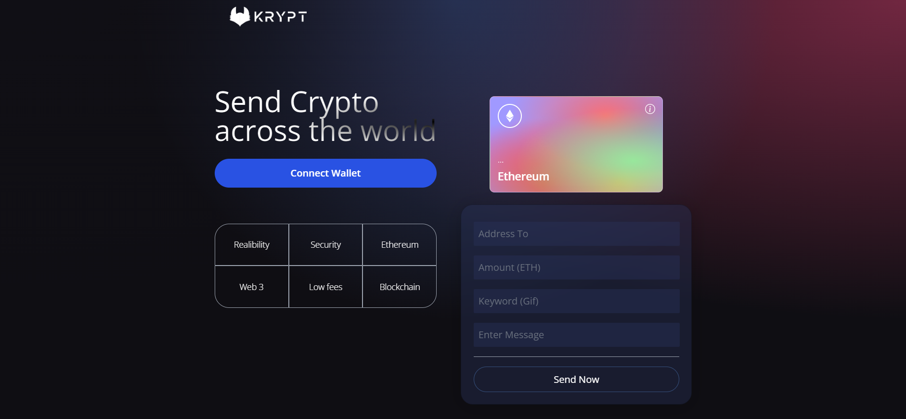

<a name="readme-top"></a>

# Web3 project Krypt

<a href="https://web3-krypt-project.netlify.app/" target="_blank">

</a>
&nbsp;
<hr>


<details>
  <summary>Table of Contents</summary>
  <ol>
    <li><a href="#about-the-project">About The Project<a></li>
      <ul>
        <li><a href="#features">Features</a></li>
      </ul>
    <li><a href="#built-with">Built with</a></li>
    <li>
      <a href="#getting-started">Getting Started</a>
      <ul>
        <li><a href="#setup">SETUP</a></li>
      </ul>
    </li>
  </ol>
</details>


## About The Project

Web3 app for connecting Metamask Wallet and transferring Ethereum(ETH) to other wallets.

### Features

- [ ] Connection to MetaMask wallet
- [ ] Transferring ETH 
- [ ] Transactions history 
- [ ] Adding gif for any transaction by sending a message

<p align="right">(<a href="#readme-top">back to top</a>)</p>

## Built with
<a href="https://docs.soliditylang.org/en/v0.8.17/" target="_blank" rel="noreferrer">  </a>&nbsp;
<a href="https://html.spec.whatwg.org/multipage/" target="_blank" rel="noreferrer">  </a>&nbsp;
<a href="https://www.w3schools.com/css/" target="_blank" rel="noreferrer">  </a>&nbsp;
<a href="https://www.javascript.com/" target="_blank" rel="noreferrer">  </a>&nbsp;
<a href="https://reactjs.org/" target="_blank" rel="noreferrer">  </a>&nbsp;
<a href="https://tailwindcss.com/" target="_blank" rel="noreferrer">  </a>&nbsp;
<a href="https://axios-http.com/docs/intro" target="_blank" rel="noreferrer">  </a>&nbsp;
<a href="https://app.netlify.com/" target="_blank" rel="noreferrer">  </a>&nbsp;
<a href="https://giphy.com/" target="_blank" rel="noreferrer">  </a>&nbsp;


## Getting Started

To get a local copy up and running follow this simple example step.
   ```sh
    git clone "the repository name"
   ```

### SETUP
_Below is an instructions on installing and setting up the app._
1. Install Node.js latest version - https://nodejs.org/en/
   ```sh
    npm i
    npm start
   ```
2. Download MetaMask wallet - https://metamask.io/
3. Sign Up to GIPHY for using gifs - https://giphy.com/
4. Create a new app in GIPHY
<p align="right">(<a href="#readme-top">back to top</a>)</p>

